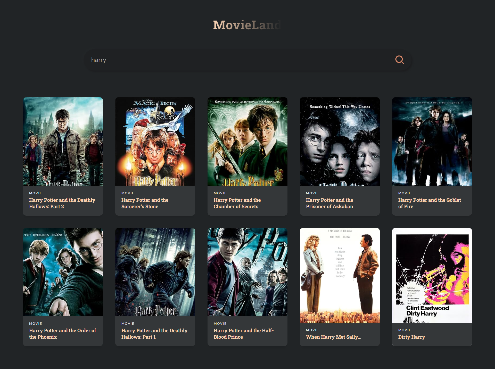

<!DOCTYPE html>
<html lang="en">
<head>
    <meta charset="UTF-8">
    <meta name="viewport" content="width=device-width, initial-scale=1.0">
    <title>MovieLand README</title>
    
</head>
<body>
    

        <h1>MovieLand</h1>
        
        <h2>Features</h2>
        <ul>
            <li>Search for movies by title</li>
            <li>View movie details including release year, poster, and type</li>
            <li>Practice foundational React concepts such as <code>useEffect</code> and <code>useState</code></li>
        </ul>
        <h2>Getting Started</h2>
        <ol>
            <li>Clone the repository to your local machine:</li>
            <pre><code>git clone https://github.com/your-username/MovieLand.git</code></pre>
            <li>Navigate to the project directory:</li>
            <pre><code>cd MovieLand</code></pre>
            <li>Install dependencies:</li>
            <pre><code>npm install</code></pre>
            <li>Start the development server:</li>
            <pre><code>npm start</code></pre>
            <li>Open your browser and visit <a href="http://localhost:3000">http://localhost:3000</a> to view MovieLand.</li>
        </ol>
        <h2>Usage</h2>
        <ol>
            <li>Enter a movie title in the search bar.</li>
            <li>Press Enter or click the search button to retrieve movie information.</li>
            <li>Explore the search results to find the movie you're interested in.</li>
            <li>Click on a movie to view its details, including the release year, poster, and type.</li>
        </ol>
        <h2>Technologies Used</h2>
        <ul>
            <li>React.js</li>
            <li>OMDb API</li>
            <li>HTML</li>
            <li>CSS</li>
        </ul>
    

</body>
</html>
